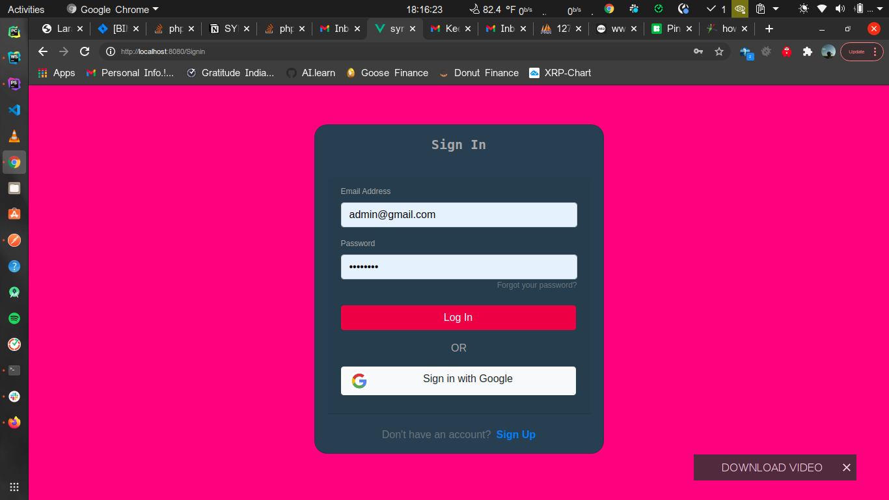
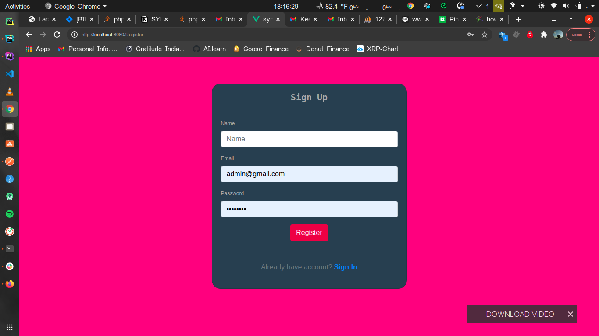
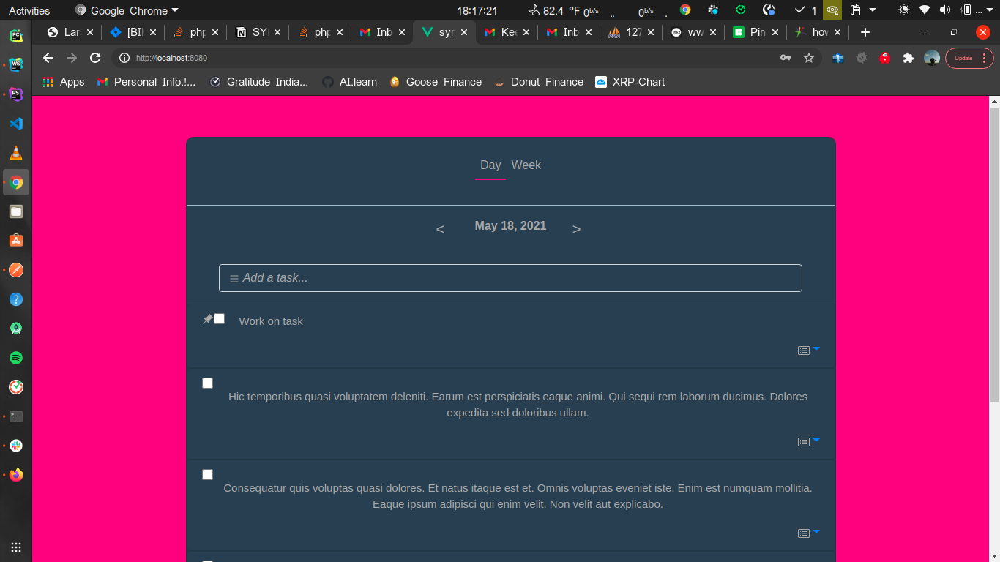
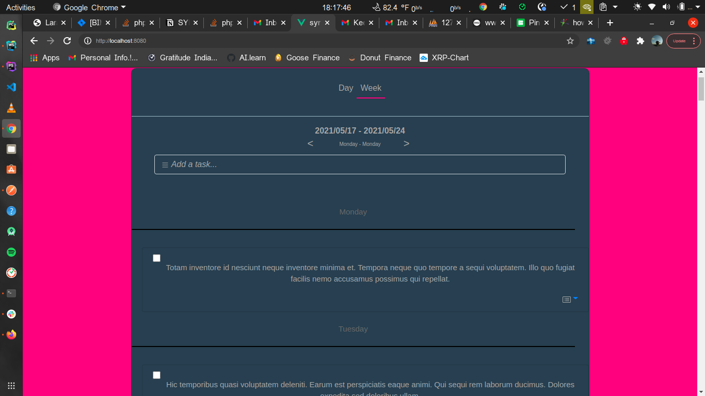

# syntax_client
Client fro todo app

## Project setup
```
npm install
```

### Compiles and hot-reloads for development
```
npm run serve
```

### Login


### Register


### Day View


### Week View


### Customize configuration
See [Configuration Reference](https://cli.vuejs.org/config/).
